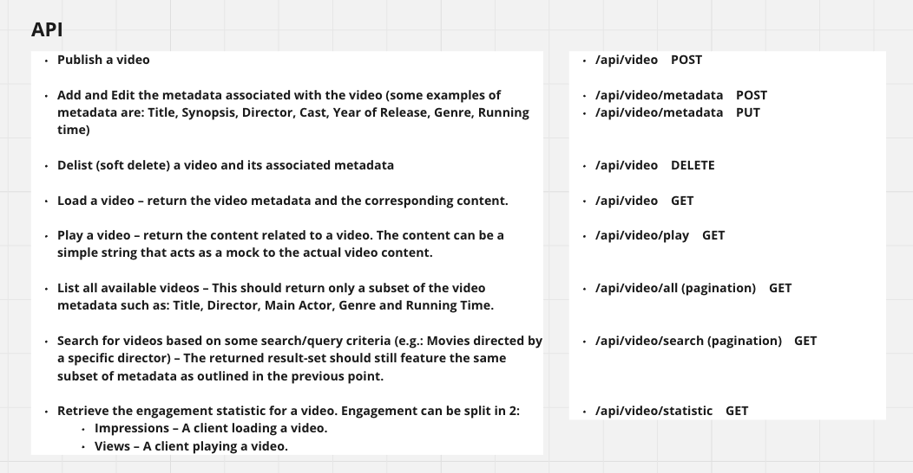
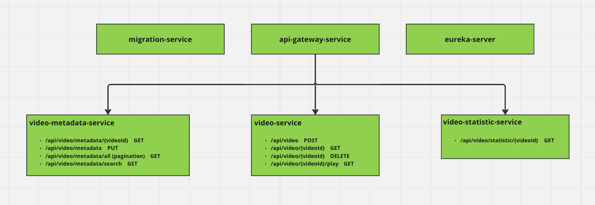
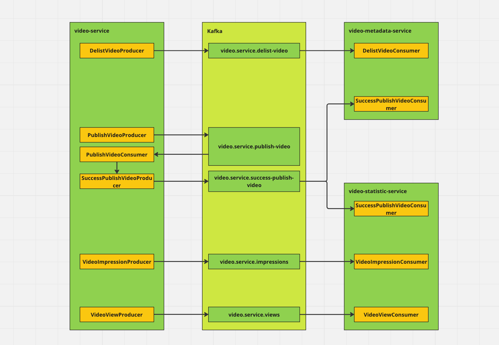
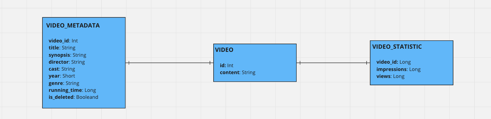

# Video Streaming Api

## Decisions
- Kafka is used as a message broker to handle the communication between the services.
- Flyway is used for database migration.
- PostgreSQL is used as the database.
- Eureka is used for service discovery.

## Possible Improvements
- Implement asynchronous REST API for better performance.
- Implement tests for the services.
- Divide video playing process into chunks to enhance performance.

## Api Definition

## Service Mapping

1. **migration-service** - responsible for Flyway migration.
2. **api-gateway-service** - responsible for routing requests to the appropriate service.
3. **eureka-service** - responsible for service discovery.
4. **video-service** - responsible for video management.
5. **video-metadata-service** - responsible for video metadata management.
6. **video-statistic-service** - responsible for video statistics management.

## Service Communication

## Data design

